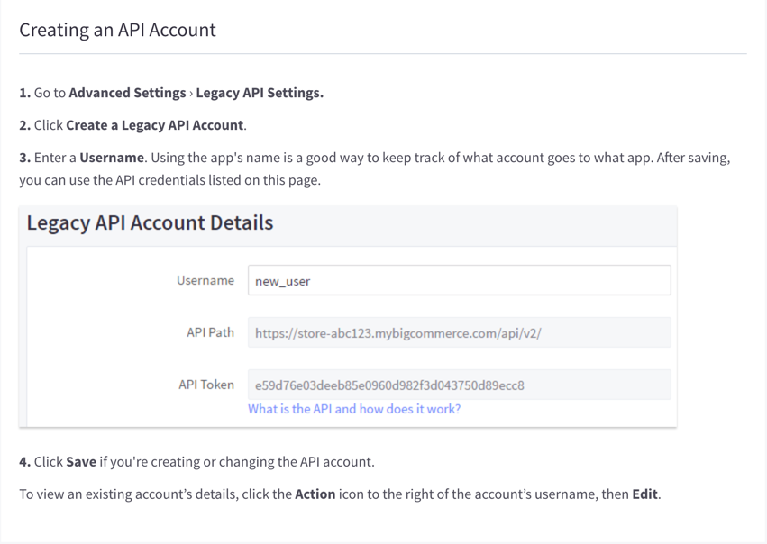

## Endpoint Setup

Log in to your BigCommerce store at [https://login.bigcommerce.com/login](https://login.bigcommerce.com/login).

1. Get your legacy API Key

2. Copy the Legacy Account Values, as they are needed to create an instance.
