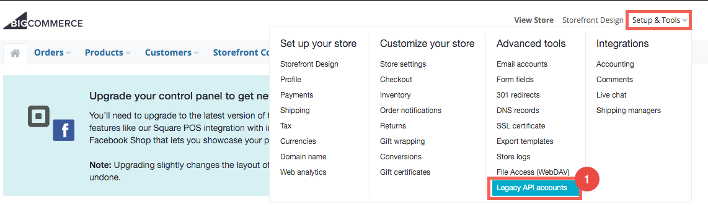
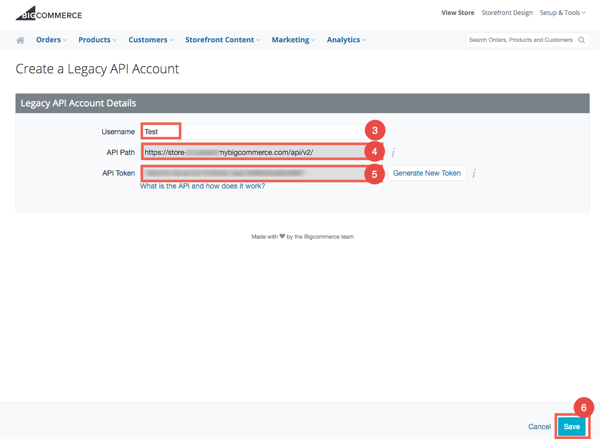

## Endpoint Setup

Log in to your BigCommerce store at [https://login.bigcommerce.com/login](https://login.bigcommerce.com/login).
1. Click Setup & Tools.

2. Select Legacy API Accounts.

3. Type the name of the user in the Username box

4. Copy the contents of the API Path box and paste this value into a text editor

5. Copy the contents of the API Token box and paste this value into a text editor.

6. Click "Save"

