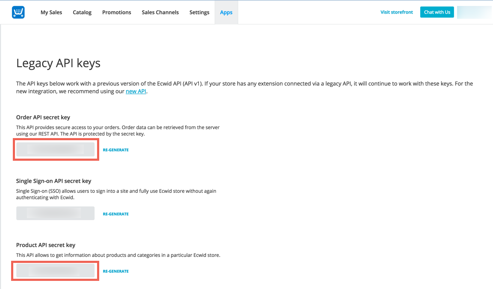

## Endpoint Setup

Follow these steps to set up a new Ecwid Application for API integration. Via a web browser go to: [https://my.ecwid.com/cp/#register](https://my.ecwid.com/cp/#register) and sign up. It must be a paid account.

Once setup, please login.

1. Make note of your Store ID as it will be needed to provision an Element Instance.

2. Next the Legacy API keys will need to be retrieved.  In order to do retrieve them, you must be __logged in__ to your store.

Once you are logged in, navigate to a Legacy API Key URL:

https://my.ecwid.com/cp/CP.html#legacy_api

Copy the Order and Product API secrets

Input the following URL in the `ION Cannon endpoint URL` field:

`https://api.cloud-elements.com/elements/api-v2/events/ecwid`

Click `Save`.
