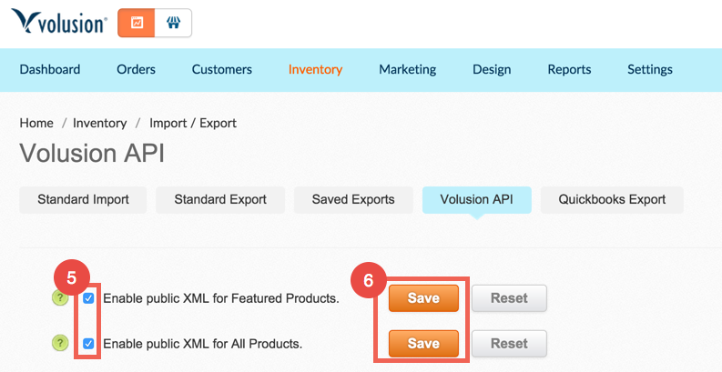
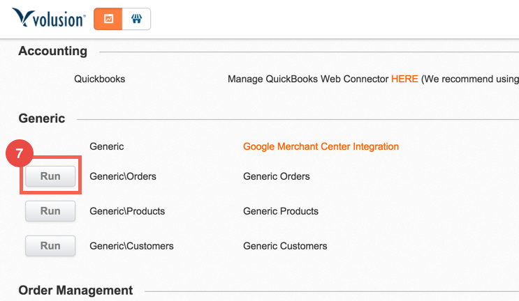
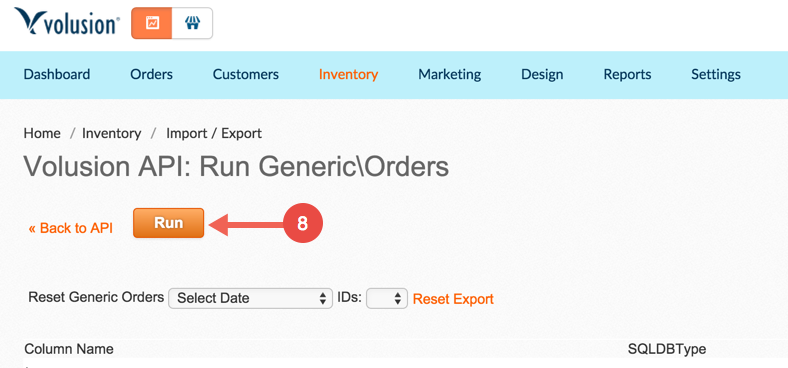
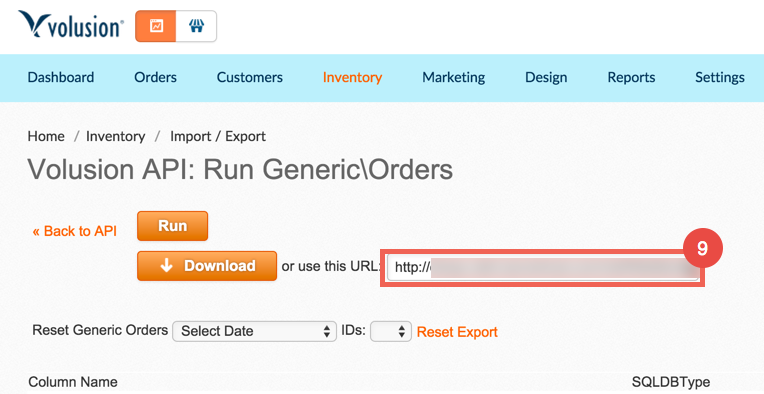
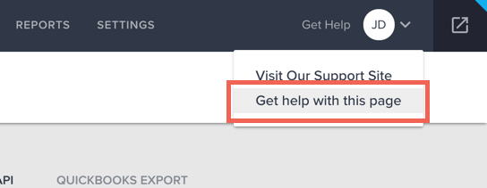
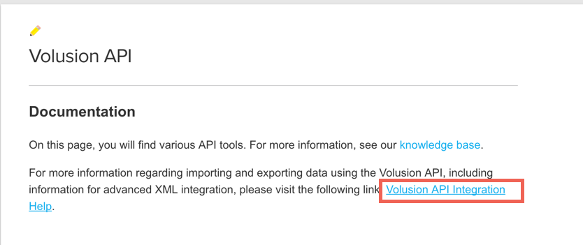
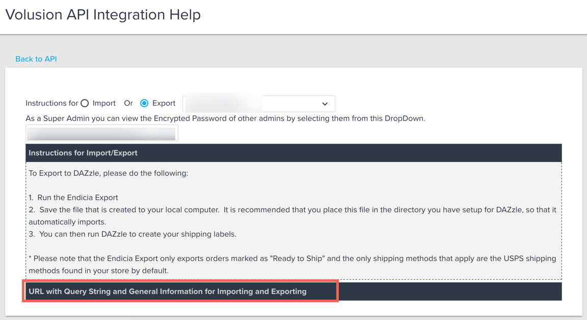
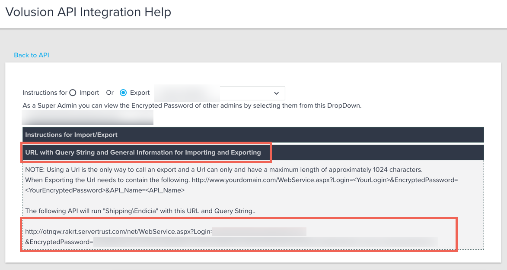

## Endpoint Setup

Follow these steps to create a New Volusion Application for API integration. Via a web browser go to: [http://www.volusion.com/](http://www.volusion.com/) and setup a store. Once setup, please login.

1. From the Dashboard, click “Manage Store”

2. Login to your storefront.

3. From the dashboard, click “Inventory” and then click “Import/Export”.

4. Click “Volusion API”

5. Make sure you enable public XML for both “Featured Products” and “All Products”

6. Click “Save

7. Next, scroll down to the Generic orders section, under Accounts and click “Run”.

8. Click “Run”

9. Copy the URL returned from the “Run” command.  It will be needed to provision the Volusion Element.

An example of the URL copied in the previous step can be seen below:

`http://otnqw.rakrt.servertrust.com/net/WebService.aspx?Login=volusion@acmedata.com&EncryptedPassword=64F3C0572DB54CB36951010E7200391418E79AC678214B366FBD4E&EDI_Name=GenericOrders`

The beginning portion of the URL is your store URL – `http://otnqw.rakrt.servertrust.com`. Then the login email – volusion@acmedata.com, and finally the EncryptedPassword – `64F3C0572DB54CB36951010E7200418E79AC678214B366FBD4E&EDI`

### Need Help finding your Encrypted Password?

1. From the Dashboard, click "Manage Store"

2. Login to your storefront.

3. From the dashboard, click "Inventory" and then click "Import/Export".

4. Click "Volusion API"

5. Click "Get Help" then "Get help with this page" in the top right corner.

6. In the pop up window, click "Volusion API Integration Help".

7. In the new window, click on the lower box labeled "URL with Query String and General Information for Importing and Exporting".

8. In this box, you will find your encrypted password.

